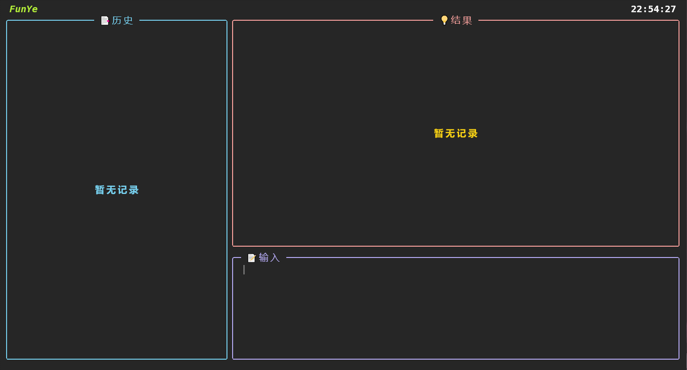

# FunYe



**FunYe**是一个基于[Textual](https://github.com/Textualize/textual)框架的TUI翻译程序（终端程序）


## 使用

Windows

`program`目录下的FunYe.exe是Windows上的可执行文件，下载到本地，到Powershell中切换到文件所在目录下，输入以下命令即可使用。（实测在windows自带的终端模拟器无法完整渲染，最好使用Windows Terminal）

```Powershell
.\FunYe.exe
```

Linux

`program`目录下的FunYe是Linux上的可执行文件，下载到本地，到终端中切换到文件所在目录下，输入以下命令即可使用。

```bash
chmod +x ./FunYe && ./FunYe
```

> 因为程序有使用系统剪切板的功能，Windows上可以会报毒，杀毒软件中允许即可
>
> 如果`program`中的可执行文件无法运行，需要自行重新编译

快捷键

- `Enter` 提交翻译内容
- `up` 上一个输入记录
- `down` 下一个输入记录
- `ESC` 退出程序
- `ctrl+l` 清空输入框中的内容
- `ctrl+y` 拷贝当前的翻译结果


## 编译

Windows

```powershell
.\bin\make.bat
```

Linux

```bash
source ./bin/make.sh
```

> 有`make`也可以直接`make`


## 配置颜色样式

`config/style.py`中可以进行颜色的调整，修改后重新编译一下即可。

## 支持
- [Textual(v0.1.18)](https://github.com/Textualize/textual)：一个python的TUI框架(现在框架已更新到新的分支)

- [Rich](https://github.com/Textualize/rich)：一个 Python 库，可以为您在终端中提供富文本和精美格式

- [textual-inputs](https://github.com/sirfuzzalot/textual-inputs)：一个基于Textual的输入小组件

- [pyperclip](https://github.com/asweigart/pyperclip)：一个用于复制和粘贴剪贴板函数的跨平台 Python 模块，它可以与 Python2和3一起工作。

- [网易有道翻译](https://fanyi.youdao.com/)
