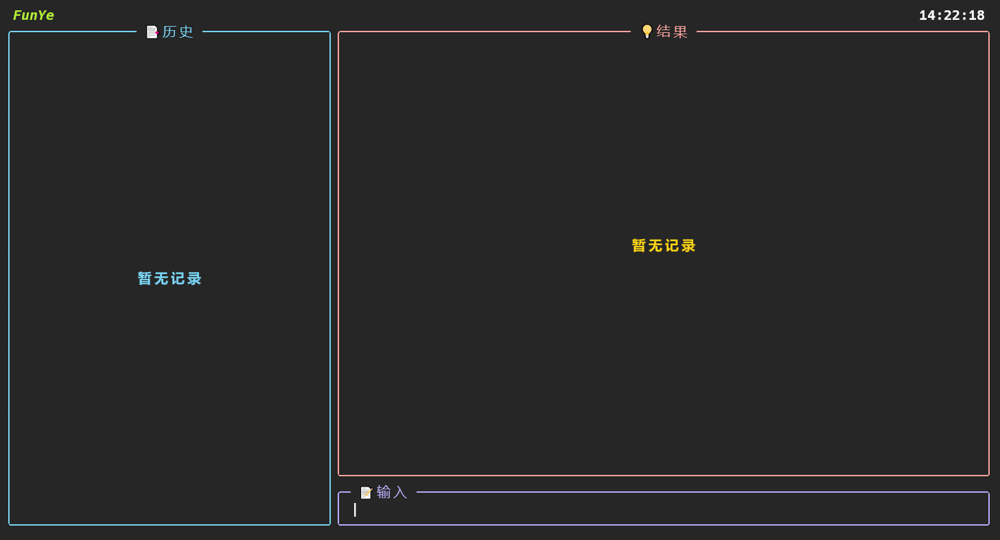

# FunYe



**FunYe**是一个基于[Textual](https://github.com/Textualize/textual)框架的TUI翻译程序（终端程序）


## 使用

Windows

[这里](https://github.com/kaze-k/FunYe/releases/tag/v1.0.0)有Windows上的可执行文件，下载到本地，到Powershell中切换到文件所在目录下，输入以下命令即可使用。（实测在windows自带的终端模拟器无法完整渲染，最好使用Windows Terminal或者好点的终端模拟器）

```Powershell
.\FunYe.exe
```

Linux

[这里](https://github.com/kaze-k/FunYe/releases/tag/v1.0.0)有Linux上的可执行文件，下载到本地，到终端中切换到文件所在目录下，输入以下命令即可使用。

```bash
chmod +x ./FunYe && ./FunYe
```

> 因为程序有使用系统剪切板的功能，Windows上可能会报毒，杀毒软件中允许即可
>
> 如果下载的可执行文件无法运行，需要自行重新编译

快捷键

- `Enter` 提交翻译内容
- `up` 上一个输入记录
- `down` 下一个输入记录
- `ESC` 退出程序
- `ctrl+l` 清空输入框中的内容
- `ctrl+y` 拷贝当前的翻译结果


## 编译

Windows

```powershell
.\bin\install.bat # 安装依赖
.\bin\make.bat # 执行编译
```

Linux

```bash
sh ./bin/install.sh # 安装依赖
sh ./bin/make.sh # 执行编译
```

> 有`make`也可以直接`make`
> 
> 需要在项目根目录下运行脚本编译


# 开发工具

`tools`目录下有一些开发脚本

``` sh
python ./tools/devtools.py -h # 查看如何使用
```

`bin`目录下有一些命令脚本

- `install.sh` 和 `install.bat` 安装项目依赖，编译前一定要先执行
- `make.sh` 和 `make.bat` 执行编译
- `remove.sh` 和 `remove.bat` 移除项目所有依赖、删除虚拟环境、清理pyc缓存文件
- `run.sh` 和 `run.bat` 启动一下FunYe

> `tools` 和 `bin` 目录下的脚本都要在项目的根目录下运行


## 配置颜色样式

`config/style.py`中可以进行颜色的调整，修改后重新编译一下即可。


## 最后

> 这个程序有些缺点
> 1. 在网络比较慢的时候，会卡住，因为在等待网络请求，界面无法重新更新渲染
> 2. 输入中文不太友好，输入法的光标会不在预料之中，虽然Textual新版本出了input组件，但是仍没有很好的支持
> 3. 终端模拟器的兼容不是很好，像windows自带的终端就不能很好的渲染


## 支持
- [Textual(v0.1.18)](https://github.com/Textualize/textual)：一个python的TUI框架(现在框架已更新到新的版本)

- [Rich](https://github.com/Textualize/rich)：一个 Python 库，可以为您在终端中提供富文本和精美格式

- [textual-inputs](https://github.com/sirfuzzalot/textual-inputs)：一个基于Textual的输入小组件

- [pyperclip](https://github.com/asweigart/pyperclip)：一个用于复制和粘贴剪贴板函数的跨平台 Python 模块，它可以与 Python2和3一起工作。

- [网易有道翻译](https://fanyi.youdao.com/)
